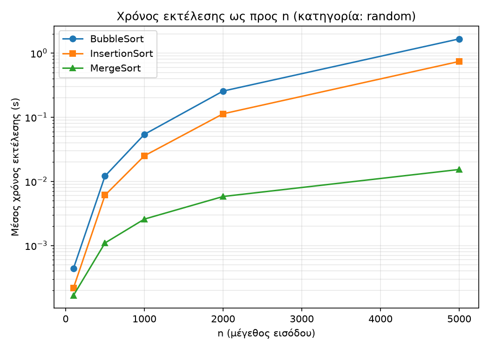
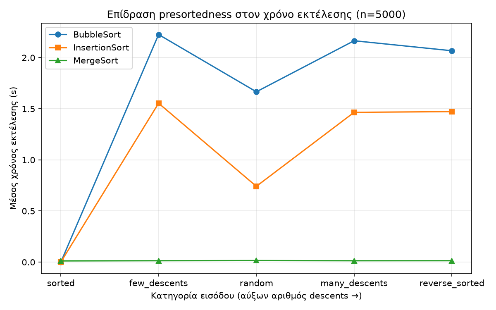

# 📊 Algorithms Analysis in Python

Two algorithm studies in Python, combining theory with experiments.
Individual assignments for the Algorithms & Complexity course at the University of Thessaly.

## 1. Sorting algorithms: theory vs experiments
Folder: `sorting-algorithms/`

- Implemented **Bubble Sort**, **Insertion Sort** and **Merge Sort**, with counters for comparisons and running time
- Generated 5 input types: sorted, reverse sorted, random, few descents, many descents
- Ran 750 experiments (n = 100 to 5000, 10 repetitions each) and saved the results to CSV
- Created plots with matplotlib

**Key findings**
- Bubble and Insertion Sort grow as Θ(n²), Merge Sort as Θ(n log n). For n = 5000, Merge Sort was about 100× faster than Bubble Sort.
- On already sorted input, Bubble and Insertion Sort beat Merge Sort (they become Θ(n)).
- The cost depends on the number of **inversions**, not descents: a sequence with only 5% descents was as slow as a fully reversed one.




## 2. Dijkstra vs Bellman-Ford with negative weights
Folder: `dijkstra-vs-bellman-ford/`

- Implemented Dijkstra and Bellman-Ford (with negative cycle detection)
- Tested both on 100,000 random graphs with weights −1 / +1
- Result: Dijkstra gave wrong distances in about 74% of the graphs, exactly the ones with a negative cycle

## Tech
Python · matplotlib · CSV · Algorithm analysis

## How to run
```bash
cd sorting-algorithms
pip install matplotlib
python G4_experiments.py   # runs the experiments, creates the CSV
python G5_plots.py         # creates the plots

cd ../dijkstra-vs-bellman-ford
python extension_random_graphs.py
```
